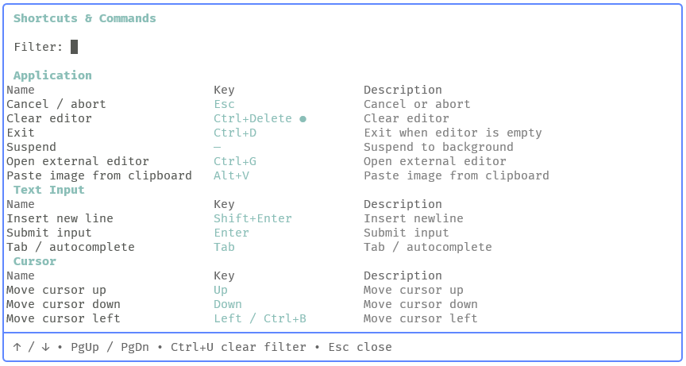

# pi-shortcuts

[](https://www.npmjs.com/package/@siesing/pi-shortcuts)

A small [pi coding-agent](https://github.com/badlogic/pi-mono/tree/main/packages/coding-agent) extension that adds a searchable keyboard and command shortcuts overlay.

It gives you a fast in-app reference for pi's built-in keybindings and any extension commands currently loaded in the session.

## Features

- Shows pi built-in keybindings grouped by category
- Refreshes built-in keybindings from the installed pi version at startup
- Falls back to a bundled built-in snapshot if refresh fails
- Includes extension slash commands in the same overlay
- Supports live filtering as you type
- Highlights the first match in each row
- Detects overrides from `~/.pi/agent/keybindings.json`
- Marks customized built-in keybindings in the UI
- Opens from both a slash command and a keyboard shortcut

## Installation


### Option A: Global Install (recommended)

```bash
pi install npm:@siesing/pi-shortcuts
```

### Option B: Single Project-Local Install

```bash
cd my-project
pi install -l npm:@siesing/pi-shortcuts
```

## Usage

Open the overlay with either:

- `/shortcuts`
- `Ctrl+Alt+K`

Screenshot:



Inside the overlay:

- Type to filter results
- `↑` / `↓` scroll one line
- `PgUp` / `PgDn` scroll by page
- `Ctrl+U` clears the filter
- `Esc` closes the overlay

> [!NOTE]
> Built-in keybindings are loaded from a startup-generated snapshot derived from the installed pi version. The extension caches that snapshot in `.pi-shortcuts-cache/builtin-keybindings.cache.json` and refreshes it when the pi version, platform, or snapshot schema changes. The package also ships with a bundled fallback snapshot, so the overlay still works if refresh fails. If you customize pi keybindings in `~/.pi/agent/keybindings.json`, matching built-in entries are updated in the overlay and marked as customized.

## How it works

The extension builds the overlay from two sources:

1. A startup-generated snapshot of pi built-in keybindings
2. Extension commands returned by `pi.getCommands()`

At startup, the extension:

1. Loads the bundled fallback snapshot
2. Reads the cached snapshot, if present
3. Regenerates the snapshot from pi's internal keybinding definitions when the cache is stale
4. Converts snapshot bindings into overlay rows using extension-owned presentation metadata
5. Applies runtime overrides from `~/.pi/agent/keybindings.json`
6. Appends live extension commands from `pi.getCommands()`

Built-in rows come from pi's internal keybinding definitions, while naming, grouping, and ordering remain extension-owned metadata. The final rows are normalized into a searchable table, filtered client-side, and rendered in a centered overlay.

## Development

Install dependencies:

```bash
npm install
```

Run tests:

```bash
npm run tests
```

Run typecheck:

```bash
npm run typecheck
```

## Package structure

```text
index.ts                           Extension entry point and snapshot loading
builtin-metadata.ts                Built-in naming, grouping, and ordering metadata
cache.ts                           Snapshot cache helpers
generator.ts                       Installed-pi snapshot generator
generated/builtin-keybindings.json Bundled fallback snapshot
key-format.ts                      Shared keybinding formatting helpers
overlay.ts                         Overlay UI, filtering, flattening, rendering
highlight.ts                       Match detection and highlighting helpers
snapshot.ts                        Snapshot parsing and row conversion
types.ts                           Shared types
tests/                             Unit tests
```
